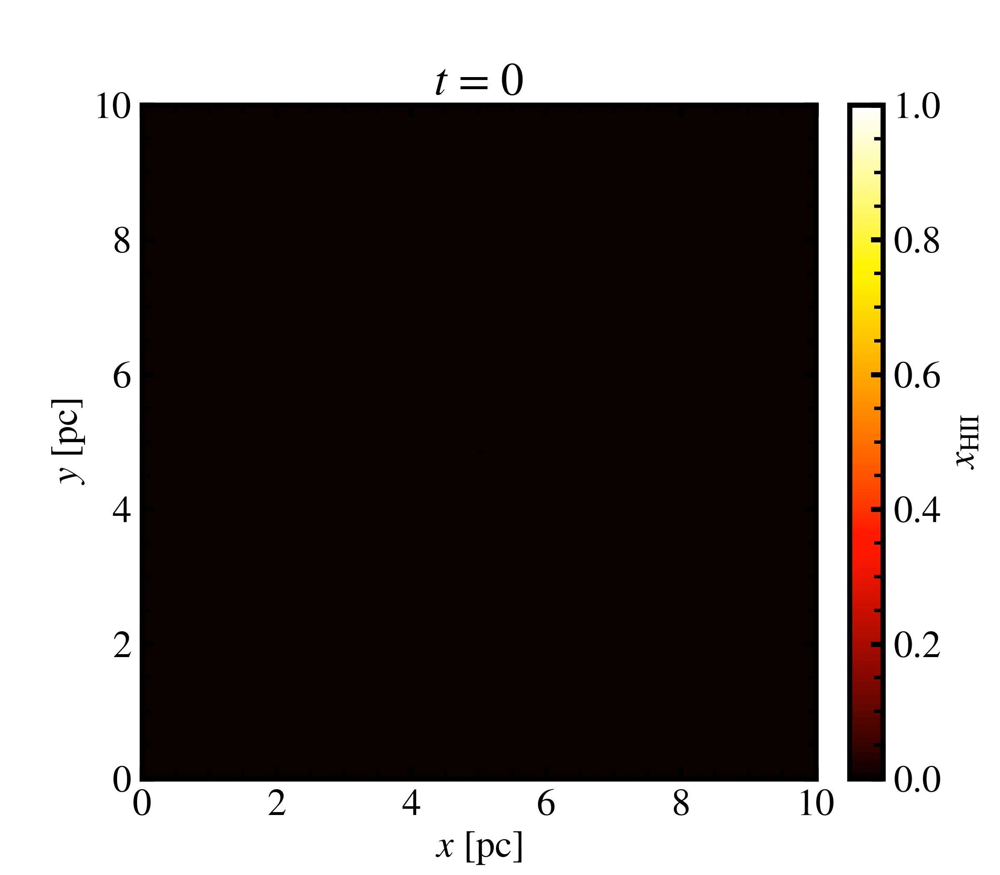

# Radiation Hydrodynamics with Python

Final Project for APC 523 at Princeton University.

Group Members: Zachary Andalman, Yue Pan, James Sunseri

In this project we use a 2nd-order finite volume Godunov scheme to simulate the hydrodynamics, a 1st-order finite volume Godunov scheme to simulate the radiation via the M1 Closure scheme, and we couple these with non-equilibrium thermochemistry. For our project, we simulate how ionizing radiation interacts with hydrogen. Our simulation consists of only one photon species with an energy of 13.6 eV. 

For examples on how to run our code, see the `notebooks` directory. To download the code, simply clone this repository and run either of the jupyter notebooks.

Example of the hydro solver.

Example of the radiation solver.

Example of Radiation Hydrodynamics Solver (End Result), simulating the ionization sphere around an O type star embedded in a box of neutral hydrogen. Below we show the evolution of the ionization fraction

